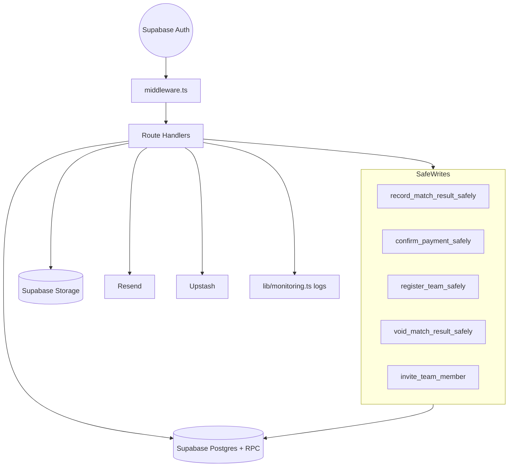

# API Map — BallDoenSai.com

**Status:** updated **6 September 2026**, verified against `app/api/**`.

All APIs are Next.js Route Handlers under `app/api/`. Authentication is via Supabase
Auth session (cookie), enforced in each handler + `middleware.ts`. There is **no**
separate auth route — login is handled by Supabase client in `app/login`.

## Endpoint inventory

### Authentication
| Endpoint | Method | Purpose | Auth | Status |
| --- | --- | --- | --- | --- |
| *(Supabase Auth)* | — | Email OTP + Google OAuth | — | EXISTING (`app/login`) |

### Users
| Endpoint | Method | Purpose | Auth | Status |
| --- | --- | --- | --- | --- |
| `/api/account/delete-athlete-data` | POST | PDPA self-deletion (`delete_my_athlete_data`) | user | EXISTING |
| `/api/mobile/account/delete-athlete-data` | POST | Mobile PDPA self-deletion using the same deletion service and RPC as Web | user bearer token | EXISTS IN REPO; live Staging test pending |

### Players / Athletes
| Endpoint | Method | Purpose | Auth | Status |
| --- | --- | --- | --- | --- |
| `/api/players/...` | — | Public profile pages (not API routes) | anon | EXISTING (page) |
| *(athlete_profiles writes)* | — | Via `app/profile` server actions | user | EXISTING |
| `/api/mobile/onboarding` | POST | Atomically create/update Mobile onboarding, Athlete Identity and Sport Profile; send guardian email when required | user bearer token | STAGING DEPLOYED; SQL 22 applied; real JWT test pending |
| `/api/guardian-verification/request` | POST | Start email-only guardian verification; works with Web cookie or Mobile bearer token | athlete | EXISTS IN REPO; requires SQL 20 + Resend/domain config |
| `/api/guardian-verification/confirm` | POST | Redeem a single-use guardian verification link | link token | EXISTS IN REPO; requires SQL 20 |
| `/api/guardian-verification/revoke` | POST | Revoke consent and make all Sport Profiles private | link token | EXISTS IN REPO; requires SQL 20 |

### Teams
| Endpoint | Method | Purpose | Auth | Status |
| --- | --- | --- | --- | --- |
| `/api/teams/[teamId]/status` | POST | Update team status | organizer/admin | EXISTING |
| `/api/teams/[teamId]/payment` | POST | Create payment + upload slip | user (owner) | EXISTING |
| `/api/teams/[teamId]/members` | GET/POST | List roster; POST invites by email (`invite_team_member`), rate limited 10 / 10 min per caller | team creator / tournament organizer / admin | EXISTING |
| `/api/teams/[teamId]/join` | POST | Athlete asks to join (`request_team_membership`). Eligibility is enforced in the RPC, not the picker: 400 `CANNOT_REQUEST_OWN_TEAM`, 409 `TEAM_NOT_ACCEPTING_REQUESTS` (unconfirmed team or closed tournament), 409 `ACTIVE_MEMBERSHIP_EXISTS`, 429 `TEAM_MEMBERSHIP_RATE_LIMITED`, 404 `TEAM_NOT_FOUND`. The two state codes require step 25 | authenticated athlete | EXISTING (hardened by SQL 25) |
| `/api/teams/joinable` | GET | Confirmed teams in open tournaments the caller may request (`list_joinable_teams`, sql/25). Returns team/tournament names only; 503 until step 25 is applied | authenticated | EXISTING (needs SQL 25) |
| `/api/team-members/[id]` | PATCH | Membership transitions, one RPC per action: `respond` → `respond_team_invite` (invited athlete), `approve`/`decline` → `approve_team_request` / `decline_team_request` (team creator, organizer, admin), `remove` → `remove_team_member` with a 10–500 char reason (those three, or the member themself) | per-action, enforced inside each RPC | EXISTING |

### Matches / Results
| Endpoint | Method | Purpose | Auth | Status |
| --- | --- | --- | --- | --- |
| `/api/match-results` | POST | Preview/confirm match result (`record_match_result_safely`). Rejects any performance whose athlete has no `accepted` membership on the submitted team, before the RPC is called | organizer/admin | EXISTING |
| `/api/match-results/[id]/void` | POST | Void result (`void_match_result_safely`) | organizer/admin | EXISTING |

### Tournaments
| Endpoint | Method | Purpose | Auth | Status |
| --- | --- | --- | --- | --- |
| `/api/tournaments` | GET/POST | List / create tournament | anon / organizer | EXISTING |
| `/api/tournaments/[id]` | GET/PATCH | Get / edit tournament | organizer (owner) | EXISTING |
| `/api/tournaments/[id]/teams` | GET | Teams in tournament | organizer/owner | EXISTING |

### Ranking
| Endpoint | Method | Purpose | Auth | Status |
| --- | --- | --- | --- | --- |
| *(read)* | — | `player_ratings`/`player_ranks` public queries | anon | EXISTING (page + `revalidateTag`) |
| *(legacy `/api/ratings`)* | — | **disabled on purpose** | — | REMOVED (use match-result flow) |

### BDS Points (XP) / Identity
| Endpoint | Method | Purpose | Auth | Status |
| --- | --- | --- | --- | --- |
| *(XP/Badge)* | — | Computed in DB triggers from `rating_events` | — | EXISTING (no direct API) |

### AI
| Endpoint | Method | Purpose | Auth | Status |
| --- | --- | --- | --- | --- |
| — | — | No AI endpoints exist | — | UNKNOWN |

### Media / Highlights
| Endpoint | Method | Purpose | Auth | Status |
| --- | --- | --- | --- | --- |
| `/api/highlights/[id]/media` | GET | Signed/owned media access | owner/admin/public | EXISTING |
| `/api/highlights/[id]/moderate` | POST | Hide/unhide (admin) | admin | EXISTING |
| `/api/highlights/[id]/report` | POST | Report content | user | EXISTING |

### Payments
| Endpoint | Method | Purpose | Auth | Status |
| --- | --- | --- | --- | --- |
| `/api/payments/[id]/confirm` | POST | Confirm payment (`confirm_payment_safely`) | organizer/admin | EXISTING |
| `/api/payments/[id]/slip` | GET | 60s signed slip URL | owner/organizer/admin | EXISTING |

### Admin
| Endpoint | Method | Purpose | Auth | Status |
| --- | --- | --- | --- | --- |
| `/admin/*` pages | — | Moderation, operations, create ranking, hall | admin | EXISTING (pages) |

### Reference data
| Endpoint | Method | Purpose | Auth | Status |
| --- | --- | --- | --- | --- |
| `/api/provinces` | GET | Thailand provinces | anon | EXISTING |
| `/api/provinces/[id]` | GET | Province detail | anon | EXISTING |
| `/api/regions` | GET | Thailand regions | anon | EXISTING |

## API dependency diagram

## Cross-cutting concerns

- **Rate limiting:** `lib/rate-limit.ts` (Upstash, fallback in-memory) applied per route
  (e.g. match-results: 20 / 5 min).
- **Audit logging:** `lib/monitoring.ts` structured JSON logs for high-risk actions.
- **Season scoping:** all ranking/result/card queries read `ACTIVE_SPORT`/`ACTIVE_SEASON`
  from `lib/season.ts`.
- **Safe writes:** business-critical mutations go through `security definer` RPC
  functions, not direct client writes, so RLS + concurrency are enforced server-side.
- **Mobile bearer tokens:** `/api/mobile/onboarding` and
  `/api/guardian-verification/request` accept an Expo Supabase access token and create
  a server Supabase client with that same identity. This is not a second auth system.
