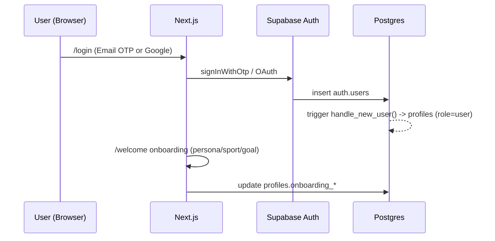
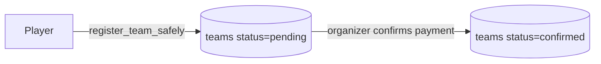
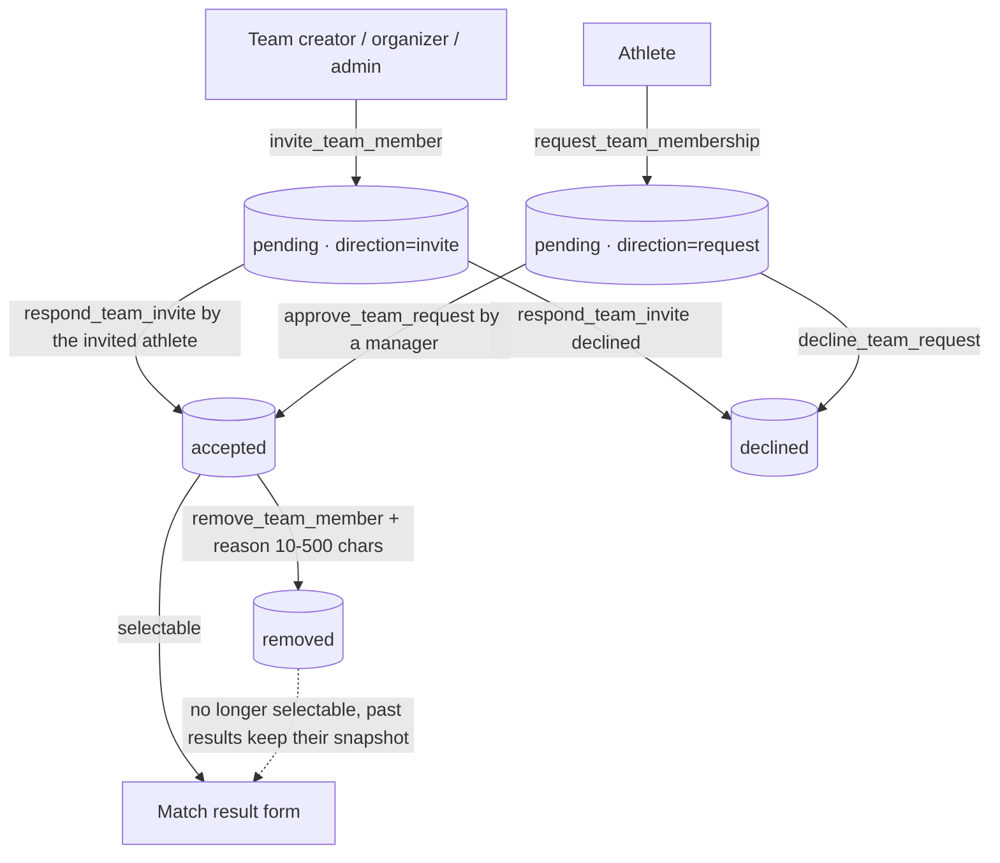
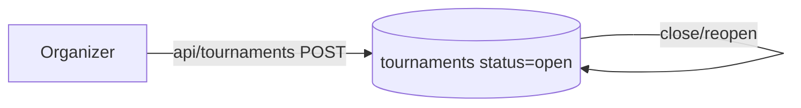
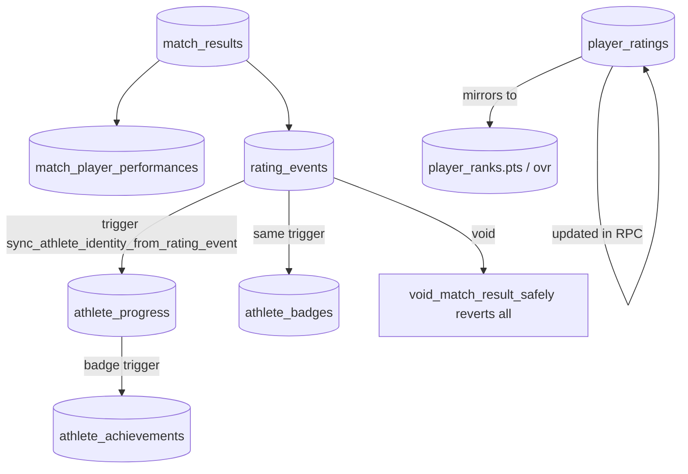
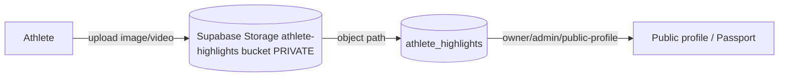
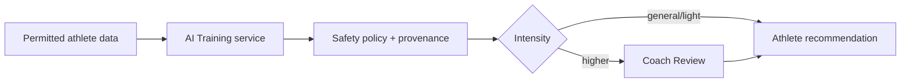

# Data Flow — BallDoenSai.com

**Status:** updated **30 August 2026**, verified against `sql/*`, `app/api/**`, `lib/**`.

Each flow below is tagged `[EXISTING]`, `[PLANNED]`, or `[UNKNOWN]`. The core rule of
the platform: **a verified match result is the single source of Rating, XP, Badge,
and Ranking** — never browser input (see `digital-identity-v1.sql` header).

## 1. User Registration



**Status:** EXISTING. `fix-profile-auth-trigger.sql`, `onboarding-v1.sql`.

## 2. Player Profile

```mermaid
flowchart LR
  A[Login] --> B[/welcome choose athlete]
  B --> C[trigger creates athlete_profiles]
  C --> D[rookie badge + 50 XP]
  D --> E[Edit profile form]
  E --> F[(athlete_profiles)]
  F --> G{RLS + guardian consent}
```

**Status:** EXISTING. On insert of `athlete_profiles`, DB trigger
`create_rookie_identity()` grants `rookie` badge + 50 XP. Publishing a minor requires
birth date + `guardian_consent_at` (enforced in DB: `guardian-consent-enforcement-v1.sql`).

## 3. Team



### Roster lifecycle (step 24)



**Status:** EXISTING. Every transition above is an approved RPC; `UPDATE` on
`team_members` is revoked from `authenticated`, so no client writes the table
directly. Both directions rate-limit a repeat row for the same (team, athlete) to one
per 10 minutes, and an active (`pending`/`accepted`) row blocks a duplicate.

`team_members` preserves invite/request/accept/remove history: a removed period is
kept and a rejoin inserts a new row, allowed by the partial unique index on
(`team_id`, `athlete_id`) `where status in ('pending','accepted')`.

After step 24, every new confirmed player performance must reference an accepted
membership row (`match_player_performances.team_membership_id` +
`membership_verified_at`); there is no admin override. Removing a member takes effect
immediately for *new* results only — the snapshot on an already-confirmed performance
is never rewritten, and correcting one still goes through `void_match_result_safely`.

## 4. Tournament



**Status:** EXISTING. Managed by organizer role; public read.

## 5. Match

```mermaid
flowchart LR
  O[Organizer] -->|select 2 confirmed teams| R[/dashboard/results]
  R -->|preview| P[Rating preview via lib/rating.ts]
  R -->|accepted roster only| TM[(team_members)]
  TM -->|confirm + snapshot| M[(match_results + match_player_performances + rating_events)]
```

**Status:** EXISTING. Confirmed via `record_match_result_safely()` RPC. Step 24 makes
the RPC fail closed unless each rank is linked to an account accepted on that team.

## 6. Match Result (the identity engine)



**Status:** EXISTING. All derived identity data is computed in DB triggers from
`rating_events`. Voiding a result reverses Rating, XP and Badge together
(`match-result-void-v1.sql`).

## 7. Performance Data

**Status:** EXISTING. Stored in `match_player_performances` (goals, assists,
clean_sheet, mvp, save_percentage) and aggregated into `player_ratings`.

## 8. Video Upload



**Status:** EXISTING. Private bucket, served only to owner/admin/public-profile via
storage policy. YouTube/TikTok URLs can also be stored as `athlete_videos.video_url`.

## 9. AI Training Recommendation  (NOT IMPLEMENTED)

The approved first AI use case is a training focus and light drill based on permitted
profile data, verified performance and Coach Assessment:



**Status:** PLANNED. **No AI or ML code exists in the repo.** AI output never writes
Rating, XP, Badge or Verified Result data. Computer vision, scouting and prediction are
later possibilities; a future CV-derived performance event would still require
organizer verification before entering the integrity chain. See `ai-architecture.md`.

## 10. Ranking

```mermaid
flowchart LR
  RR[(player_ratings.power_rating)] --> PRK[(player_ranks.pts/ovr)]
  PRK -->|public query| Rank[/ranking page + revalidateTag]
```

**Status:** EXISTING. `BALLSAI Rating V1` (Elo-style + performance modifiers),
`lib/rating.ts` computes preview; DB commits the value. Confidence level
(provisional/active/full) from `matches_played`.

## 11. BDS Points (XP)

> "BDS Points" in the brief maps to the **XP system** in this codebase
> (`athlete_progress.xp_total`, `athlete_xp_events`). Renamed here to avoid inventing
> a second currency.

```mermaid
flowchart LR
  RE[(rating_events)] -->|trigger| XP[(athlete_xp_events)]
  XP -->|sum| AP[(athlete_progress.xp_total)]
  AP -->|formula| LVL[current_level = 1 + floor(sqrt(xp/100))]
```

**Status:** EXISTING. Awarded only from verified match records (`digital-identity-v1.sql`).
A player without a `player_ranks` row earns no match XP (only the 50 rookie XP).

## 12. Notification

```mermaid
flowchart LR
  MR[(match_results confirmed)] -->|trigger notify_match_result_created| N[(notifications)]
  AB[(athlete_badges)] -->|trigger notify_badge_earned| N
  T[(teams status change)] -->|trigger notify_team_status_changed| N
  N -->|email for team_status| Resend
  N -->|in-app| App[/notifications]
```

**Status:** EXISTING (partial). In-app notifications + `team_status` email exist.
Push notifications, badge/result emails beyond team_status: UNKNOWN/PLANNED.
