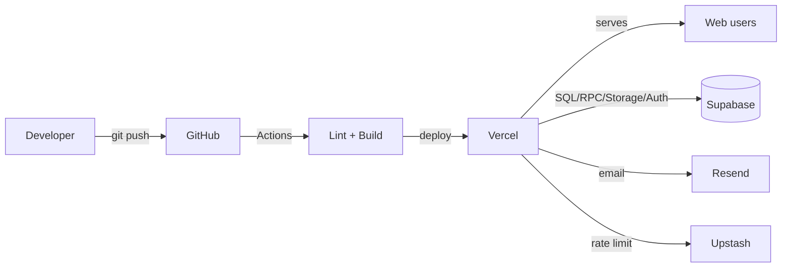

# Deployment — BallDoenSai.com

**Status:** updated **30 August 2026**, verified against `.github/workflows/ci.yml`,
`.vercel/`, `README.md`, `docs/closed-beta-runbook.md`, `lib/*`.

| Layer | Technology | Status | Evidence |
| --- | --- | --- | --- |
| Frontend | Next.js 14 App Router (React 18, Tailwind) served as static + server components | EXISTING | `app/`, `package.json` |
| Backend | Next.js Route Handlers on Vercel (same deployable as frontend) | EXISTING | `app/api/**` |
| Database | Supabase Postgres (project `hivedzrwrrcnjrlirhtv`) + RLS + RPC | EXISTING | `sql/*`, `lib/supabase-server.ts` |
| Storage | Supabase Storage (`slips`, `athlete-avatars`, `athlete-highlights`) | EXISTING | `sql/*` buckets |
| AI | — | UNKNOWN | no code |
| CDN / Edge | Vercel edge network (implied by Vercel hosting) | EXISTING (implied) | `@vercel/analytics` |
| DNS | Custom domain `balldoensai.com` | PLANNED | `README.md` §8 Phase 2 |
| Monitoring | Vercel runtime logs + structured `console` JSON logs (`lib/monitoring.ts`); Vercel Analytics + Speed Insights | EXISTING | `lib/monitoring.ts` |
| Error tracking | Sentry | PLANNED | `runbook` §9 |
| Product analytics | PostHog / Vercel Web Analytics | PLANNED | `runbook` §9 |
| CI/CD | GitHub Actions: lint + production build on every push/PR | EXISTING | `.github/workflows/ci.yml` |

## Deployment topology



## Build-time vs runtime configuration

- **Build-time (public):** `NEXT_PUBLIC_SUPABASE_URL`, `NEXT_PUBLIC_SUPABASE_ANON_KEY`,
  `NEXT_PUBLIC_ACTIVE_SPORT`, `NEXT_PUBLIC_ACTIVE_SEASON`, `NEXT_PUBLIC_SHOW_DEMO_DATA`,
  `NEXT_PUBLIC_APP_URL`. Changing the season requires a redeploy (`lib/season.ts`).
- **Runtime (server-only):** `RESEND_API_KEY`, `RESEND_FROM_EMAIL`,
  `UPSTASH_REDIS_REST_URL`, `UPSTASH_REDIS_REST_TOKEN`. No service-role key is held by
  the app (by design — see `data-deletion-v1.sql`).

## Verification gates (run locally / CI proxy)

```bash
npm run lint
npm run build
npm run verify:production   # fails unless 6 prod vars set + demo data off
npm run smoke:public        # public page smoke test
npm run security:rls        # RLS safe-mode checks with real JWTs
```

## Known deployment risks / gaps

- **No IaC for the five core tables** — `profiles`, `tournaments`, `teams`,
  `player_ranks`, `payments` are created manually in Supabase, so a fresh environment
  cannot be reproduced from `sql/` alone. (See `../data/README.md`.)
- **`slips` bucket is manual** — must be created private in Storage UI before first
  upload; step 12 of the runbook enforces privacy after the fact.
- **Role assignment is manual** — `profiles.role` set by hand; no self-serve admin UI.
- **Single active season** — `lib/season.ts` is build-time; rolling seasons needs a
  redeploy, not a runtime switch.
- **Rate limiting fallback** — without Upstash, in-memory limit is per-instance only
  (unsafe under multiple Vercel instances).
- **DNS / custom domain** — not yet wired; production currently on `*.vercel.app`.
