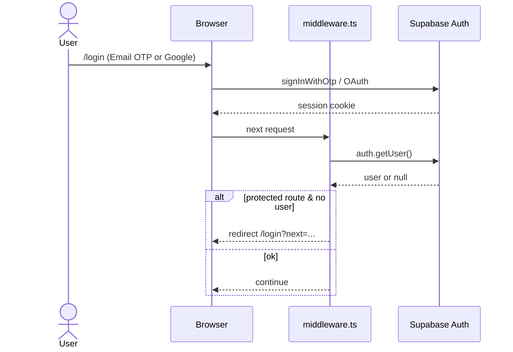
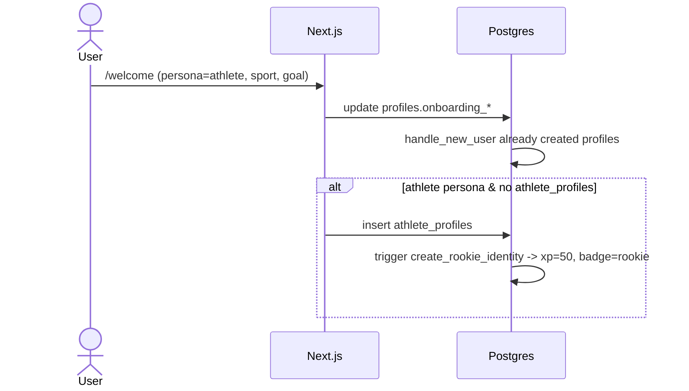
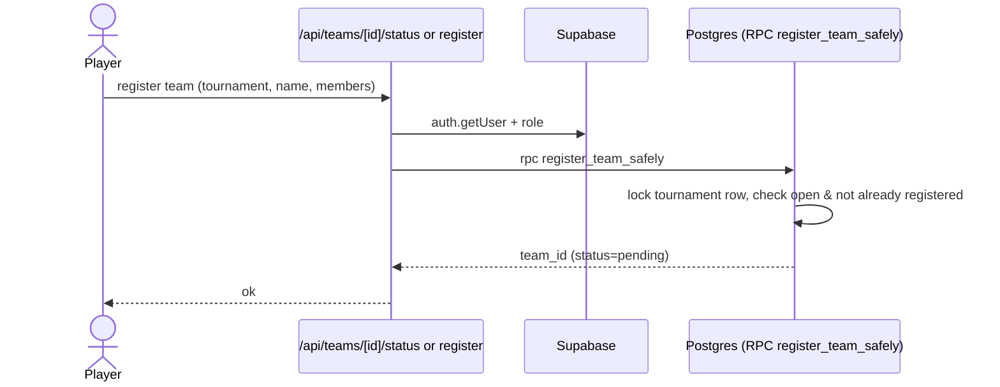
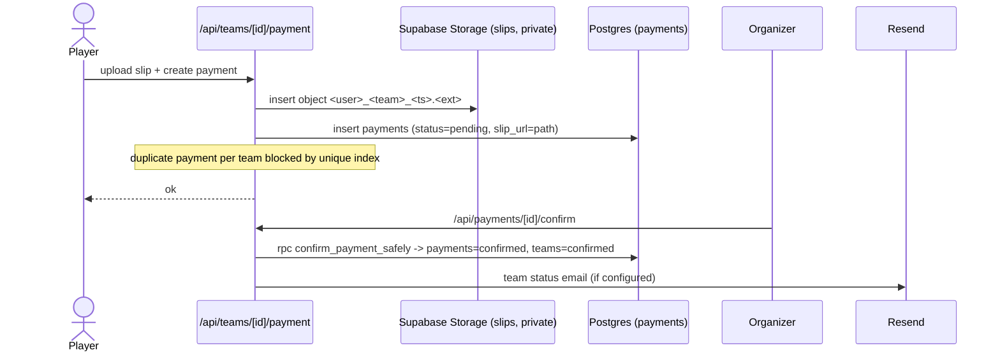
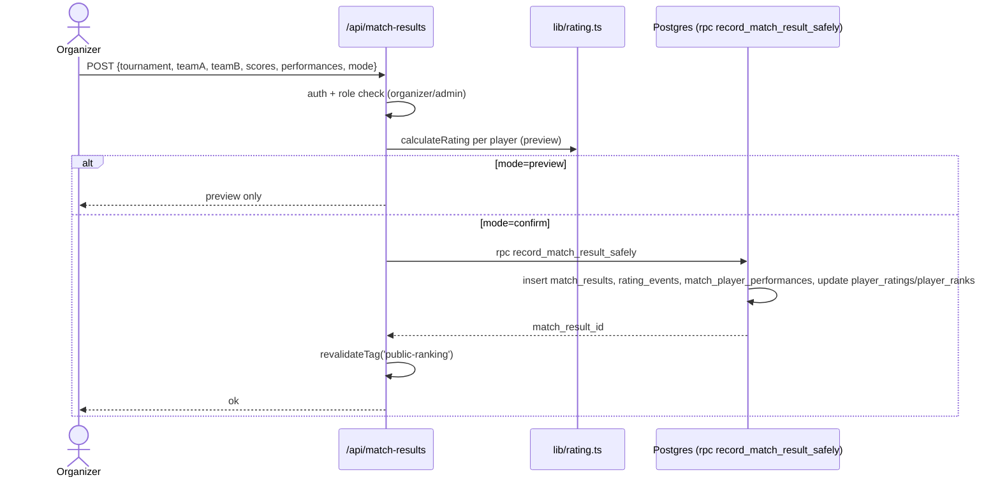
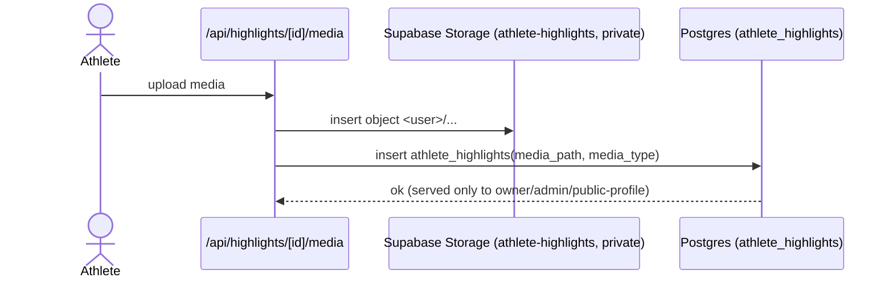
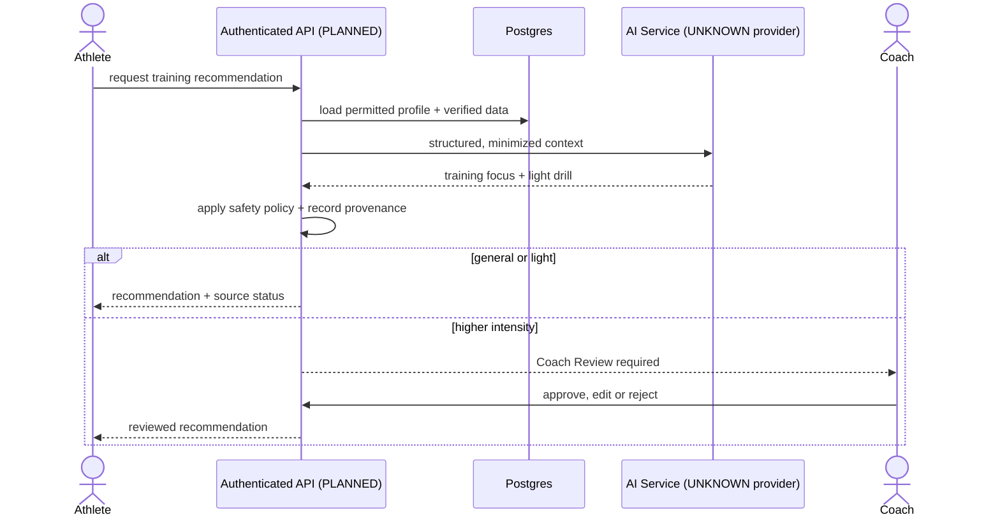
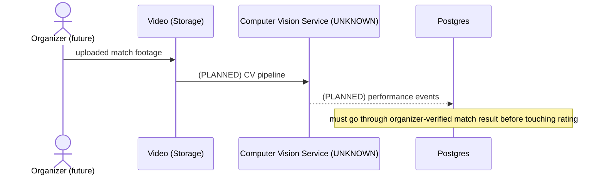
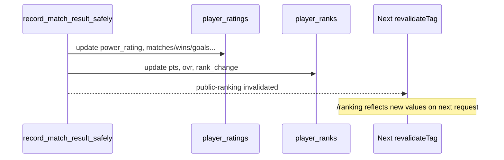
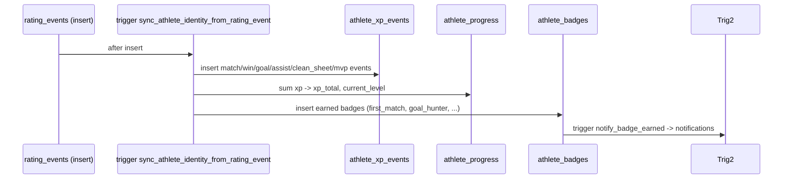

# Sequence Diagrams — BallDoenSai.com

**Status:** updated **30 August 2026**. Each diagram reflects the **actual code path**
in `app/api/**` and `sql/*`. Flows not yet implemented are marked `[PLANNED]`.

## 1. User Login

**Status:** EXISTING.

## 2. Player Registration (first visit)

**Status:** EXISTING.

## 3. Join Team

**Status:** EXISTING. Roster `members` is free text today.

## 4. Tournament Registration (team + slip)

**Status:** EXISTING.

## 5. Submit Match Result

**Status:** EXISTING.

## 6. Upload Video

**Status:** EXISTING.

## 7. AI Training Recommendation - NOT IMPLEMENTED

**Status:** PLANNED. No AI service, endpoint or review storage exists. AI output cannot
write Rating, XP, Badge or Verified Result data. See `ai-architecture.md`.

### Later AI: Video Analysis

**Status:** UNKNOWN / PLANNED. This is not part of the Mobile MVP.

## 8. Ranking Update

**Status:** EXISTING.

## 9. BDS Points (XP) Reward

**Status:** EXISTING.
