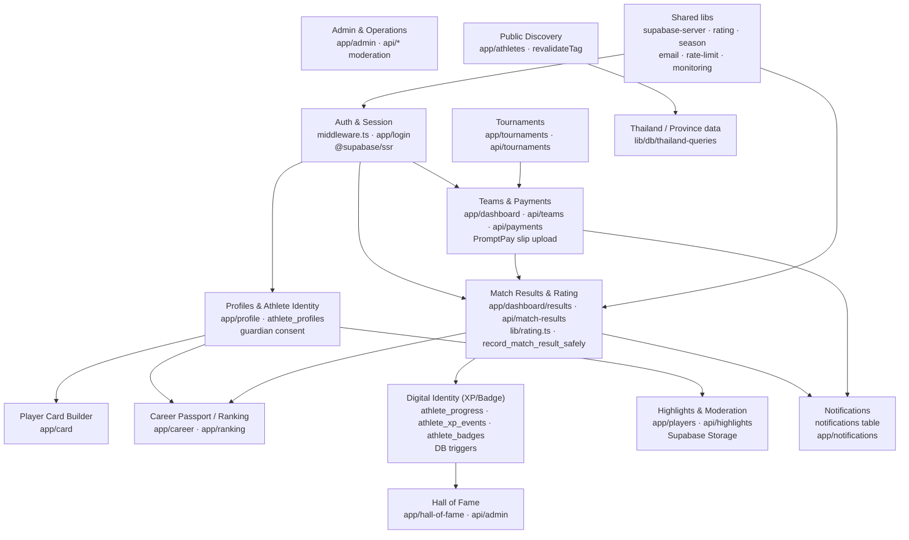

# System Architecture — BallDoenSai.com

**Status:** updated **3 September 2026**, verified against the repo and the separate
Expo mobile app.

C4 Model **Level 2 (Containers)** and **Level 3 (Components)**. The system is a
**modular monolith**: a single Next.js 14 App Router application on Vercel that
talks to Supabase as a Backend-as-a-Service. It is **not** microservices. A separate
Expo app has Auth/session, OAuth callback and RLS-backed Athlete Profile, Performance,
Ranking, Competition and Match read modules. Real-account testing and Store releases
remain PLANNED.

## C2 — Containers

```mermaid
graph TD
  Browser["Web Browser<br/>(Server + Client Components)"] -->|HTTPS| Next["Next.js App<br/>(Vercel)<br/>Route Handlers + Pages"]
  Next -->|Auth / SQL / Storage / RPC| Supabase["Supabase<br/>Postgres + RLS<br/>Auth + Storage"]
  Next -->|Transactional email| Resend["Resend API"]
  Next -->|Rate limit (optional)| Upstash["Upstash Redis"]
  Next -.->|Web Analytics| Vercel["Vercel Analytics"]

  subgraph Mobile["Expo Mobile - Athlete read experience"]
    iOS["iOS App"] -->|Auth + RLS-backed reads| Supabase
    Android["Android App"] -->|Auth + RLS-backed reads| Supabase
  end
```

| Container | Technology | Responsibility | Status |
| --- | --- | --- | --- |
| Web (Browser) | Next.js 14 App Router, React 18, Tailwind | All UI, server components, cached public data | EXISTING |
| Next.js App (Vercel) | Next.js route handlers + RSC | Business logic, auth session, safe DB writes | EXISTING |
| Supabase | Postgres, RLS, Auth, Storage, RPC | Source of truth for all data | EXISTING |
| Resend | REST API | Team status email | EXISTING (optional) |
| Upstash Redis | REST API | Distributed rate limiting | EXISTING (optional) |
| Vercel Analytics | SDK | Page analytics + speed | EXISTING |
| iOS / Android | Expo React Native | Auth + Athlete Profile, Performance, Ranking, Competition and confirmed Match reads; no client score writes | EXISTING read experience / PLANNED beta and Store release |

## C3 — Components (inside the Next.js app)

The app is organized as feature areas under `app/` plus shared `lib/` modules. Each
component below maps to real folders/files.



### Component to code map

| Component | Key files | Notes |
| --- | --- | --- |
| Auth & Session | `middleware.ts`, `lib/supabase-server.ts`, `app/login` | Supabase Auth (OTP + Google). Protects `/dashboard`,`/admin`,`/profile` |
| Profiles | `app/profile`, `sql/athlete-profile-v2.sql` | Minor + guardian-consent rules in DB |
| Player Card | `app/card` | Client-side image export, share sheet |
| Career / Ranking | `app/career`, `app/ranking` | Reads `player_ratings`, `athlete_progress` |
| Tournaments | `app/tournaments`, `app/api/tournaments` | Organizer CRUD |
| Teams & Payments | `app/dashboard`, `app/api/teams`, `app/api/payments` | `register_team_safely`, `confirm_payment_safely`, slip = private URL |
| Match Results & Rating | `app/dashboard/results`, `app/api/match-results`, `lib/rating.ts` | Elo-style `BALLSAI Rating V1` + DB function |
| Digital Identity | `sql/digital-identity-v1.sql` | XP/Badge computed in DB triggers from `rating_events` |
| Hall of Fame | `app/hall-of-fame`, `app/admin/hall` | `hall_of_fame_entries` |
| Highlights & Moderation | `app/players`, `app/api/highlights` | Private bucket + report queue |
| Notifications | `app/notifications`, `sql/17-notifications-v1.sql` | In-app + `team_status` email |
| Admin | `app/admin/*` | Moderation, operations, create ranking |
| Public Discovery | `app/athletes`, `lib/public-data.ts` | `revalidateTag('public-ranking')` |
| Thailand data | `lib/db/thailand-queries.ts`, `api/provinces`, `api/regions` | Static reference data |

### Mobile components (separate Expo app)

| Component | Key files | Notes |
| --- | --- | --- |
| Auth & session | `src/auth/*` | SecureStore-backed session, email OTP and Google callback |
| Athlete Identity | `src/athlete/athlete-identity-module.ts`, `src/ui/AthleteProfileScreen.tsx` | RLS-backed Card/Profile read; no fallback is presented as verified performance |
| Performance & Ranking | `src/athlete/athlete-performance-module.ts`, `src/ui/PerformanceScreen.tsx` | Reads Rating, confirmed events and season-scoped BallDoenSai ranking only |
| Competition & Match | `src/athlete/athlete-competition-module.ts`, `src/ui/CompetitionScreen.tsx` | Reads open tournaments and the athlete's confirmed match performances only |
| In-app Notifications | `src/athlete/athlete-notifications-module.ts`, `src/ui/NotificationsScreen.tsx` | Reads and marks the athlete's own notifications; routes to Mobile Performance or Competition where applicable; push delivery is not implemented |

## Architecture style decision

This is a **Modular Monolith** (single deployable, clear feature modules, DB-enforced
integrity via RLS + security-definer RPC functions). It is intentionally **not**
split into microservices. See `../decisions/ADR-001-architecture-style.md`.

## What is NOT here (do not assume)

- No production mobile Store build exists yet. The external Expo project implements
  encrypted session storage, email/Google auth callbacks and RLS-backed athlete reads,
  but needs real-account testing. See ADR-006 and `../product/target-architecture.md`.
- No separate API gateway / BFF beyond Next.js route handlers.
- No background worker / queue — all writes happen synchronously in RPC functions.
- No AI/ML component — UNKNOWN (see `ai-architecture.md`).
