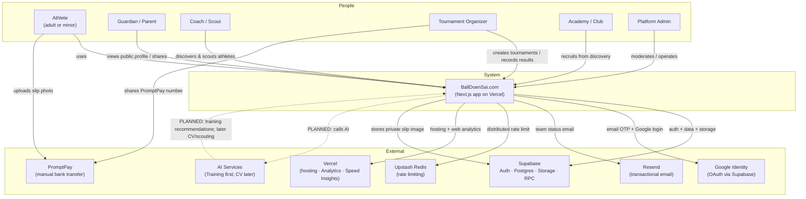

# System Context — BallDoenSai.com

**Status:** updated **3 September 2026** — verified against `README.md`, `AGENTS.md`,
`docs/closed-beta-runbook.md`, the `sql/` migrations, `app/api/**`, and `lib/**`.

C4 Model **Level 1 (System Context)**. This diagram shows the people and external
systems that touch BallDoenSai today. Every relationship is tagged
`[EXISTING]`, `[PLANNED]`, or `[UNKNOWN]` so nothing is assumed.

## Actors and trust levels

| Actor | Role in system | Access today | Evidence |
| --- | --- | --- | --- |
| Athlete (adult or minor) | Creates Card, profile, joins teams, competes | Authenticated `user` | `app/`, `profiles.role` |
| Guardian / Parent | Views/shares public profile, consents to publish | Authenticated `user` | `guardian-consent-enforcement-v1.sql` |
| Coach / Scout | Browses `/athletes`, `/ranking`, public profiles | Anonymous + authenticated | `app/athletes`, public RLS |
| Tournament Organizer | Creates tournaments, confirms payments, records results | `organizer` role | `sql/supabase-rls.sql` `is_organizer()` |
| Academy / Club | Recruits via discovery (no special role) | Anonymous | `app/athletes` |
| Platform Admin | Moderates, operates, awards Hall of Fame, creates ranking rows | `admin` role | `sql/supabase-rls.sql` `is_admin()` |

Roles `organizer` and `admin` are set **manually** in Supabase — there is no UI.
Everyone starts as `user`. (Source: `docs/closed-beta-runbook.md` §5.)

## External systems — actual vs planned

| System | Purpose | Status | Evidence |
| --- | --- | --- | --- |
| Supabase Auth | Email OTP + Google OAuth | EXISTING | `middleware.ts`, `app/login` |
| Supabase Postgres + RLS | Primary database | EXISTING | `sql/*`, `lib/supabase-server.ts` |
| Supabase Storage | Slips (private), avatars (public), highlights (private) | EXISTING | `sql/*` buckets |
| Supabase RPC (DB functions) | Safe team/payment/match-result writes | EXISTING | `production-hardening.sql`, `18-team-members-v1.sql` |
| Google OAuth | Social login | EXISTING (Testing mode) | `README.md` §4 |
| Resend | Team status email only | EXISTING (optional) | `lib/email.ts` |
| Upstash Redis | Distributed rate limiting | EXISTING (optional fallback) | `lib/rate-limit.ts` |
| Vercel | Hosting + Analytics + Speed Insights | EXISTING | `@vercel/analytics`, runbook |
| PromptPay | Manual payment (phone number, not an API) | EXISTING (manual) | `app/dashboard`, `lib/sample-data.ts` |
| AI Services (CV/LLM/Scouting) | Any automated analysis | **UNKNOWN / PLANNED** | no code reference found |
| Custom domain `balldoensai.com` | DNS | PLANNED | `README.md` §8 Phase 2 |
| Sentry / PostHog | Error & product analytics | PLANNED | `runbook` §9 |

> **Rule:** AI is drawn with a dotted line because **no AI integration exists in the
> codebase**. Do not present any AI feature as built. See `ai-architecture.md`.
