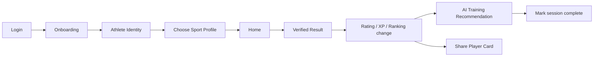
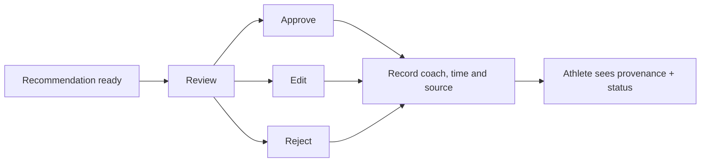

# Mobile UX And Role Flows

**Status:** `PLANNED`. Mobile is one role-aware app; Athlete remains the primary
experience.

## Navigation By Role

| Role | Primary tabs | Purpose |
| --- | --- | --- |
| Athlete | Home, Compete, Progress, Training, Profile | daily progress and participation |
| Coach | Home, Athletes, Reviews, Teams, Profile | quick review and athlete lookup |
| Guardian | Home, Athletes, Consent, Notifications, Profile | safety and visibility control |

Organizer bulk operations, Scout discovery and Admin tools remain Web-first. A person
with several roles switches context explicitly; permissions never follow from the
currently visible tab alone.

## Athlete Core Flow

Home prioritizes the latest verified change, next competition and today's training
focus. It does not present empty metrics as performance. An athlete without ranking data
sees a STARTER state.

## Coach Review Flow

Mobile supports fast review. Web supports team-level queues, Assessment entry, bulk
operations and history.

## Guardian Flow

- Age 13-19: athlete initiates account, Guardian accepts a verified invitation.
- Under 13: Guardian creates and controls the Athlete Identity.
- Guardian chooses whether a Minor Athlete Sport Profile becomes public.
- Guardian can withdraw consent, make the profile private and request deletion.
- Public views never expose full birth date, school, contact or health information.

## Important States

Every core screen must design loading, empty, offline, stale, denied and error states.
Verified data displays `self`, `coach_verified` or `performance_verified`. Pending
results and AI recommendations are visually distinct from approved records.

Push deep links open the exact result, review or consent request after authentication.
Notification content on the lock screen must avoid sensitive minor data.
