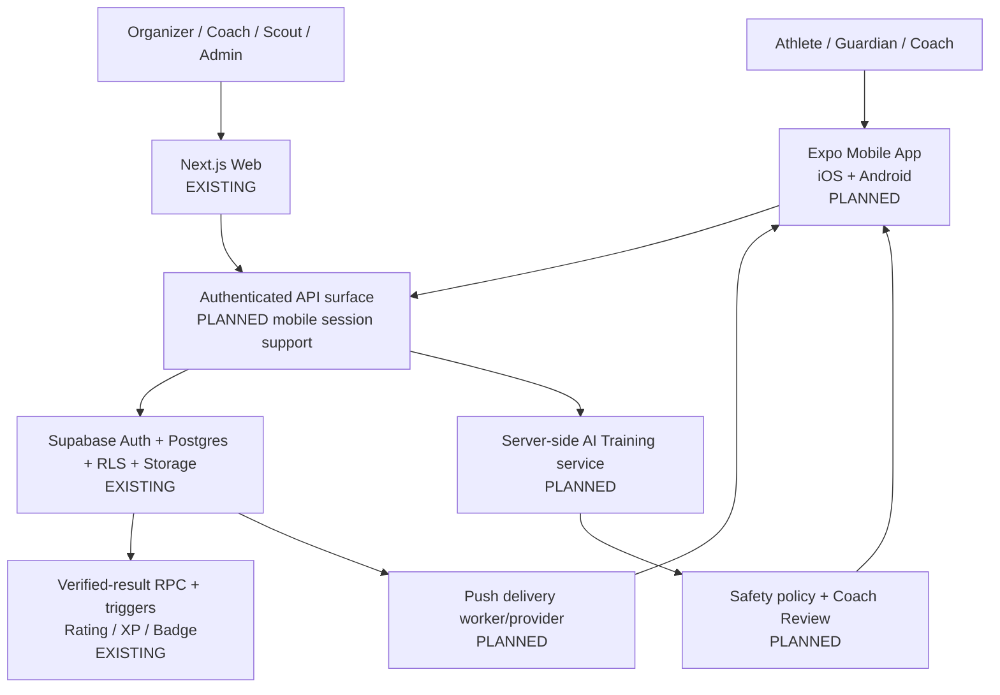

# Target Architecture

**Status:** target state. Mobile and AI components are `PLANNED`; the current Web,
Supabase and verified-result chain are `EXISTING`.

## Shape

## Architectural Decisions

- Expo React Native provides one mobile codebase and two signed Store binaries.
- The separate mobile repository is a thin client, not a second backend.
- Supabase Auth remains the identity provider for Mobile and Web.
- Mobile may read data allowed by RLS, but sensitive writes use approved API/RPC paths.
- Rating, XP, Badge and Verified Result writes remain server/database controlled.
- The existing Next.js modular monolith stays in place until measured load proves a
  specific component needs extraction.
- One Athlete Identity owns many Sport Profiles. Ratings and Rankings never cross sport,
  season, age group or competition boundaries without an explicit aggregation design.

## Mobile API Boundary

The current API was designed around browser sessions. Before connecting Mobile, each
required route must be classified as:

1. direct Supabase read protected by RLS;
2. protected Supabase RPC for an atomic domain write; or
3. Next.js route accepting and validating a mobile bearer session.

No mobile screen may bypass the verified-result chain. Secrets and AI provider keys
remain server-side.

## AI Training Boundary

Inputs are limited to permitted profile fields, sport, position, verified performance
and Coach Assessment. Output is a training focus plus optional light drill, duration and
repetition range. Every output stores its input provenance, model/policy version and
review status.

AI cannot create Rating, diagnose injury, predict a professional career or infer missing
health data. A higher-intensity recommendation requires Coach Review. A reported injury
or reduced-readiness state suppresses intensive advice.

## Scale And Performance

Scale the measured bottleneck while preserving the modular monolith:

- Postgres constraints, indexes and query plans protect the source of truth.
- RLS and security-definer RPCs protect tenant and role boundaries.
- Public rankings use bounded, cached, paginated read models.
- stateless API handlers scale horizontally; distributed rate limits are mandatory in
  production.
- notification and AI generation move to durable background jobs before public scale;
  they must not delay result confirmation.
- AI output is generated on change or request, cached by data version and rate limited.
- observability tracks API latency, database latency, queue delay, notification delivery,
  AI cost and result-to-notification SLA.

Microservices, a separate mobile backend and cross-region databases are not MVP
requirements. Introduce them only from production evidence.

## Privacy And Age Policy

The Thailand launch policy requires legal review before Public Launch:

- age 20+: self-managed consent;
- age 13-19: self-registration, with a verified Guardian before public profile or AI
  Training access;
- under 13: Guardian creates and controls the Athlete Identity;
- Minor Athlete profiles default to private;
- public profiles exclude full birth date, school, address, phone and health data;
- consent is versioned, auditable, withdrawable and connected to deletion workflows.
