# User flow — ผู้ใช้กลุ่มหลักของ BallDoenSai.com (30 ก.ย. 2026)

เขียนจากโค้ดใน `main` (`56ad105`) ไม่ใช่จากแผน: ทุกขั้นชี้หน้าหรือ API ที่มีอยู่จริง
ใช้เป็นฐานของงานปรับ UX/UI และของสคริปต์ทดสอบ W1 (`docs/closed-beta-runbook.md` §6)

กลุ่มหลัก 5 กลุ่มอยู่ในขอบเขต W1: **นักกีฬา · ผู้ปกครอง · โค้ช/ผู้จัด · แอดมิน · คนทั่วไป**
กลุ่มเสริม (เจ้าของสนาม, สปอนเซอร์, แมวมอง, องค์กร) มีโค้ดแล้วแต่อยู่นอกรอบทดสอบแรก — สรุปไว้ท้ายไฟล์

สัญลักษณ์: 🔒 ต้องล็อกอิน · 🛡️ กติกาที่ฐานข้อมูลบังคับ (ไม่ได้พึ่งหน้าเว็บอย่างเดียว) · ⚠️ จุดที่ผู้ใช้สะดุดได้ / งานมือที่ยังเหลือ

---

## ภาพรวม: ผลแข่งจริงหนึ่งนัดกลายเป็นตัวตนนักกีฬา

หัวใจของระบบ ทุก flow ด้านล่างมีไว้เพื่อให้วงนี้หมุนได้

```mermaid
flowchart LR
  A[ผู้จัดสร้างรายการแข่ง] --> B[โค้ชสมัครทีม + ส่งสลิป]
  B --> C[นักกีฬาตอบรับเข้าทีม]
  C --> D[ผู้จัดยืนยันสลิปและทีม]
  D --> E[จัดสาย/ตารางแข่ง]
  E --> F[แข่งจริง]
  F --> G[ผู้จัดบันทึกผล + Preview Rating]
  G --> H[ยืนยันผล]
  H --> I[Power Rating · XP · Badge · Ranking]
  I --> J[Player Card · Career · โปรไฟล์สาธารณะ]
  J --> K[แชร์ IG/TikTok/LINE/Facebook]
```

---

## 1. เข้าสู่ระบบและตั้งค่าครั้งแรก (ทุกกลุ่ม)

| ขั้น | ผู้ใช้ทำ | ระบบทำ | หน้า / API |
| --- | --- | --- | --- |
| 1 | กดยอมรับข้อกำหนดและนโยบาย PDPA | ปุ่มล็อกอินเปิดใช้ได้เมื่อติ๊กแล้ว | `/login` |
| 2 | เลือก **Google** หรือ **รหัสทางอีเมล (OTP)** (Facebook เปิดอยู่บน Production) | OTP: ส่งรหัส 6–10 หลัก, ส่งใหม่ได้หลัง 60 วินาที · CAPTCHA พร้อมแต่ยังปิด | `/login` |
| 3 | — | ทุกการล็อกอินผ่าน `/auth/callback` แล้วพาไป `/welcome` | `/auth/callback` |
| 4 | เลือกบทบาท 1 ใน 5: นักกีฬา · ผู้ปกครอง · โค้ช/ผู้จัด · เจ้าของสนาม · สปอนเซอร์ | บันทึก `onboarding_persona` | `/welcome` ขั้น 1 |
| 5 | เลือกกีฬาและเป้าหมาย | นักกีฬา: สร้างแถว `athlete_profiles` ว่างให้ | `/welcome` ขั้น 2–3 |
| 6 | กด "เริ่ม" (หรือ "ข้ามไปดูก่อน") | พาไปตามเป้าหมาย: Player Card → `/card`, หารายการแข่ง → `/tournaments`, ติดตามนักกีฬา → `/athletes` (ผู้ปกครอง → `/guardian`), ค้นหาดาวรุ่ง → `/athletes`, จัดการสนาม → `/venue`, สนับสนุน → `/sponsor` | — |

⚠️ ผู้ใช้บน Production ยังขอ OTP ไม่ได้เกิน 2 ฉบับ/ชม. และส่งได้เฉพาะอีเมลทีม Supabase จนกว่าจะตั้ง SMTP (T17) — W1 ใช้ Google + Test users แทน (T18)
⚠️ บทบาท "ผู้จัด" ที่เลือกเองใน `/welcome` ยังไม่ให้สิทธิ์สร้างรายการแข่ง: แอดมินต้องตั้ง `profiles.role = 'organizer'` ด้วยมือ (งานมือต่อผู้จัดหนึ่งคน)

---

## 2. นักกีฬาเยาวชน 🔒

### 2.1 ตั้งตัวตน

| ขั้น | ผู้ใช้ทำ | ระบบทำ | หน้า |
| --- | --- | --- | --- |
| 1 | เปิดโปรไฟล์ของฉัน | แสดง checklist "ก่อนเปิดโปรไฟล์สาธารณะ" 5 ข้อ: ชื่อ+วันเกิด · รูป · ตำแหน่ง+ทีม · ไฮไลต์แรก · ความยินยอมผู้ปกครอง (ถ้าอายุต่ำกว่าเกณฑ์) | `/profile` |
| 2 | กรอกชื่อ วันเกิด ตำแหน่ง ทีม จังหวัด ส่วนสูง น้ำหนัก แนะนำตัว อัปโหลดรูป | รูปเก็บใน bucket ส่วนตัว (หลัง SQL62) · วันเกิดคนอื่นอ่านไม่ได้ เห็นแค่อายุ 🛡️ (SQL58) | `/profile/edit` |
| 3 | เพิ่มวิดีโอ YouTube/TikTok, อัปโหลดไฮไลต์ (รูป/วิดีโอ ≤ 25 MB), เพิ่มผลงาน | ไฮไลต์ถูกรายงานได้ → คิวแอดมิน | `/profile/edit` |
| 4 | เปิด "โปรไฟล์สาธารณะ" | 🛡️ ต้องมีวันเกิด และถ้าเป็นผู้เยาว์ต้องมีความยินยอมผู้ปกครอง — ไม่ครบ ฐานข้อมูลปฏิเสธ (trigger) | `/profile/edit#privacy` |
| 5 | สร้าง Player Card: ใส่รูป แก้ข้อมูล เลือกธีม แชร์/บันทึกรูป | การ์ดยังไม่มี Ranking = STARTER แสดง "—" ไม่มีตัวเลขสมมติ 🛡️ กฎข้อ 8 · ป้ายบอกที่มาของตัวเลข | `/card` |

### 2.2 เข้าร่วมทีมและแข่ง

| ขั้น | ผู้ใช้ทำ | ระบบทำ | หน้า / API |
| --- | --- | --- | --- |
| 1 | ได้รับคำเชิญเข้าทีม (โค้ชเชิญด้วยอีเมล) | แจ้งเตือนในแอป | `/notifications` |
| 2 | ตอบรับ / ปฏิเสธ | `respond_team_invite` | `/team-members` · `PATCH /api/team-members/[id]` |
| 3 | ยอมรับ/ปฏิเสธคำขอยืนยันข้อมูลจากโค้ช (coach_verified) | ข้อมูลที่ยอมรับได้ป้าย "โค้ชยืนยัน" | `/team-members` (กล่องขอยืนยัน) |
| 4 | ลงแข่ง | — | สนามจริง |

### 2.3 หลังผลแข่งถูกยืนยัน (อัตโนมัติ)

| ระบบทำ | ผู้ใช้เห็นที่ |
| --- | --- |
| นัดแรกที่ยืนยันแล้ว: สร้างแถว Ranking ให้เอง (เฉพาะโปรไฟล์สาธารณะ, หลัง SQL61) · ทักษะ PAC–DEF ว่างจนโค้ช/แอดมินประเมิน | `/card`, `/players/[id]` |
| ปรับ Power Rating, XP, Level, Badge; บันทึกลง Career | `/career`, `/profile` |
| ขึ้นตาราง Ranking ทั้งประเทศ; "อันดับของฉัน #N → หน้า K" | `/ranking` |
| แจ้งเตือน | `/notifications` |

⚠️ นักกีฬาที่โปรไฟล์ไม่สาธารณะ **บันทึกผลไม่ได้** (ผู้จัดเห็นจำนวนคนที่ติดอยู่) — ต้องเปิดโปรไฟล์ก่อน ซึ่งผู้เยาว์ต้องมีความยินยอมผู้ปกครองก่อน
⚠️ ถ้าข้อมูลผิด: กด "คัดค้านข้อมูลนี้" ที่หน้าโปรไฟล์สาธารณะ → คิว data disputes ของแอดมิน

### 2.4 สิทธิ์ของตัวเอง (PDPA)

`/profile` → "ลบข้อมูลของฉัน" → พิมพ์ยืนยัน → ลบโปรไฟล์ รูปทุกไฟล์ ไฮไลต์ วิดีโอ XP Badge; ผลแข่งในรายการของผู้อื่นถูกทำให้ไม่ระบุตัวตน;
ยื่นคำขอปิดบัญชี ⚠️ แอดมินต้องปิดบัญชี auth ด้วยมือ (T28 รอตัดสิน)

---

## 3. ผู้ปกครอง 🔒

| ขั้น | ใครทำ | ระบบทำ | หน้า / API |
| --- | --- | --- | --- |
| 1 | ผู้ปกครองเลือกบทบาท "ผู้ปกครอง" ใน `/welcome` | — | `/welcome` |
| 2 | ผู้ปกครองกรอกอีเมลบัญชีของลูก + ติ๊กยืนยันความยินยอม | `request_guardian_link` 🛡️ ต้องเป็นบทบาทผู้ปกครอง · ลูกต้องมีบัญชีนักกีฬาแล้ว · ต้องติ๊กยินยอม | `/guardian` · `POST /api/guardian-links` |
| 3 | **ลูก** เห็นคำขอ แล้วกดยอมรับ | `respond_guardian_link` → บันทึกเวลาความยินยอม (`guardian_consent_at`) | `/guardian`, checklist ใน `/profile` |
| 4 | ลูกเปิดโปรไฟล์สาธารณะได้ | 🛡️ trigger ตรวจความยินยอม | `/profile/edit` |
| 5 | ผู้ปกครองติดตามโปรไฟล์ ผลงาน และไฮไลต์ของลูก | — | `/guardian`, `/players/[id]` |

⚠️ ลำดับบังคับ: **ลูกต้องสมัครก่อน** ผู้ปกครองจึงขอเชื่อมได้ (ถ้ายังไม่มีบัญชีลูก ได้ข้อความ "ไม่พบบัญชีนักกีฬา")
⚠️ ยังไม่ได้ทดสอบกับบัญชีจริง (T27) และข้อความยินยอมยังรอนักกฎหมายตรวจ (T25)

---

## 4. โค้ช / ผู้จัดแข่ง 🔒

ในระบบตอนนี้ **โค้ช (ผู้ดูแลทีม)** กับ **ผู้จัด (เจ้าของรายการแข่ง)** อาจเป็นคนเดียวกันหรือคนละคน

### 4.1 ผู้จัด: ตั้งรายการแข่ง (ต้องมี `role = organizer` หรือ admin)

| ขั้น | ผู้ใช้ทำ | ระบบทำ | หน้า |
| --- | --- | --- | --- |
| 1 | สร้างรายการแข่ง: ชื่อ รายละเอียด สนาม วันที่ ค่าสมัคร เบอร์รับโอน จำนวนทีมสูงสุด | — | `/dashboard/create` |
| 2 | เปิด/ปิดรับสมัคร | — | `/dashboard` |
| 3 | ตรวจสลิปที่ทีมส่งมา (เปิดผ่าน signed URL 60 วินาที) → ยืนยันการชำระ | 🛡️ สลิปเป็นไฟล์ส่วนตัว ผู้จัดของรายการนั้นเท่านั้นที่เปิดได้ | `/dashboard` · `/api/payments/[id]/slip`, `/confirm` |
| 4 | ยืนยัน / ปฏิเสธทีม | — | `/dashboard` · `/api/teams/[id]/status` |
| 5 | จัดสายและตารางแข่งอัตโนมัติ: น็อกเอาต์ · ลีก · แบ่งกลุ่ม+น็อกเอาต์ | — | `/dashboard/tournaments/[id]/fixtures` |
| 6 | กด "เผยแพร่ตาราง" | ทุกคนเห็นตาราง ผล และตารางคะแนน; ก่อนเผยแพร่ไม่มีใครเห็นชื่อทีม 🛡️ (SQL57) | `/tournaments/[id]/fixtures` |

### 4.2 โค้ช: สมัครทีม

| ขั้น | ผู้ใช้ทำ | ระบบทำ | หน้า / API |
| --- | --- | --- | --- |
| 1 | เลือกรายการแข่ง → กรอกข้อมูลทีม | สร้างทีม (ร่าง) | `/tournaments/[id]` |
| 2 | อัปโหลดสลิปโอนเงิน | เก็บ path ไม่ใช่ลิงก์สาธารณะ · จำกัดความถี่การอัปโหลด | `/tournaments/[id]` ขั้นชำระเงิน · `POST /api/teams/[id]/payment` |
| 3 | เชิญนักกีฬาเข้าทีมด้วยอีเมล | `invite_team_member` → นักกีฬาได้แจ้งเตือน | `/team-members` · `POST /api/teams/[id]/members` |
| 4 | รอนักกีฬาตอบรับ แล้วกด "ส่งทีม" | 🛡️ `submit_tournament_team_safely`: ต้องมีสมาชิกตอบรับแล้ว · รายการต้องยังไม่เต็ม/ไม่ปิด | `/team-members` · `POST /api/teams/[id]/submit` |
| 5 | (ทางเลือก) นำสมาชิกออก, ขอยืนยันข้อมูลนักกีฬา, วางแผนนัด | — | `/team-members`, `/match-plan` |

### 4.3 ผู้จัด: วันแข่ง — บันทึกผล (หน้าที่สำคัญที่สุดของระบบ)

| ขั้น | ผู้ใช้ทำ | ระบบทำ | หน้า / API |
| --- | --- | --- | --- |
| 1 | เลือกรายการแข่ง (ค้นหาได้ แบ่งหน้า) | โหลดเฉพาะทีม/สมาชิก/ผล 20 นัดล่าสุดของรายการนั้น | `/dashboard/results` |
| 2 | เลือกทีม A/B และสกอร์ | — | 〃 |
| 3 | เพิ่มผลงานรายคน: ประตู แอสซิสต์ คลีนชีต MVP (ค้นหาในรายชื่อทีม) | สมาชิกที่ยังไม่มี Ranking แสดงเป็น "ใหม่"; คนที่โปรไฟล์ไม่สาธารณะไม่อยู่ในรายชื่อ (บอกจำนวน) | 〃 |
| 4 | กด **Preview** | คำนวณ Rating ที่จะเปลี่ยน ให้ดูก่อน | `POST /api/match-results` (preview) |
| 5 | กด **Confirm Result** | 🛡️ บันทึกครั้งเดียว: กดซ้ำหรือเน็ตส่งซ้ำได้ผลเดียว (SQL60) · สร้าง Ranking ให้ผู้เล่นใหม่ (SQL61) · XP/Badge · ตารางแข่งเดินเอง (ผู้ชนะขึ้นรอบ, เติมอันดับกลุ่ม) | 〃 (confirm) |
| 6 | ถ้าบันทึกผิด: กด "ยกเลิกผล" | คืน Rating/XP; ถ้ารอบถัดไปมีผลแล้วจะไม่ให้ยกเลิก (ต้องยกเลิกจากหลังมาหน้า) | `/dashboard/results` |
| 7 | น็อกเอาต์ที่เสมอ: เลือกผู้ชนะจุดโทษ | — | `/dashboard/tournaments/[id]/fixtures` |

⚠️ หน้าบันทึกผลยังเป็นฟอร์มแบบ dropdown ไทยปนอังกฤษ — เป้าหมายแรกของงานปรับ UX ชุดที่ 3 เพราะผู้จัดกรอกหน้าสนาม
⚠️ รายชื่อทีมยังผูกบัญชีผ่านคำเชิญอีเมลเท่านั้น (ADR-010, T04–T06)

---

## 5. แอดมิน (ทีม BallDoenSai) 🔒 `role = admin`

| งาน | หน้า |
| --- | --- |
| ตั้งบทบาทผู้จัด/แอดมิน ⚠️ ยังทำผ่าน SQL/Dashboard ของ Supabase | Supabase |
| สร้าง Ranking ด้วยมือ (ก่อน SQL61) และประเมินทักษะ PAC–DEF | `/admin/create`, `/admin` |
| ตรวจไฮไลต์ที่ถูกรายงาน: ซ่อน/คืน | `/admin/moderation` |
| ตรวจรูปสนาม | `/admin/venue-photos` |
| คิวคัดค้านข้อมูล และความน่าเชื่อถือของข้อมูล | `/admin/trust` |
| ตั้ง Hall of Fame | `/admin/hall` |
| ดูบันทึกการทำงานของแอดมิน, สถานะระบบ | `/admin/audit`, `/admin/operations`, `/admin/infrastructure` |
| ปิดบัญชีตามคำขอลบข้อมูล ⚠️ งานมือ (T28) | Supabase Auth |

---

## 6. คนทั่วไป (ไม่ต้องล็อกอิน)

| อยากทำ | หน้า |
| --- | --- |
| ดูอันดับทั้งประเทศ กรองจังหวัด/ตำแหน่ง ค้นชื่อ แบ่งหน้าละ 50 · แท็บดาวรุ่ง, MVP | `/ranking` |
| ค้นหานักกีฬา กรองจังหวัด ตำแหน่ง ช่วงอายุ (เห็นอายุ ไม่เห็นวันเกิด) | `/athletes` |
| ดูโปรไฟล์นักกีฬาสาธารณะ: การ์ด ที่มาของข้อมูล Level/Badge ไฮไลต์ ผลงาน · รายงานไฮไลต์ไม่เหมาะสม | `/players/[id]` |
| ดูรายการแข่งและตารางที่เผยแพร่แล้ว | `/tournaments`, `/tournaments/[id]/fixtures` |
| ดู Hall of Fame | `/hall-of-fame` |

มาถึงหน้าเหล่านี้ได้จากลิงก์ที่นักกีฬาแชร์ (Facebook/LINE มีภาพ Preview การ์ดจาก OG image) → จุดเริ่มของผู้ใช้ใหม่

---

## กลุ่มเสริม (โค้ดมี แต่อยู่นอกรอบ W1)

| กลุ่ม | flow สั้น | หน้า |
| --- | --- | --- |
| เจ้าของสนาม | ลงประกาศสนาม + รูป (แอดมินตรวจ) → ตั้งช่วงเวลาซ้ำรายสัปดาห์ → รับคำขอจอง (กันจองชน 🛡️) → คุยกับผู้จอง / เสนอเลื่อน / ยกเลิก | `/venue` · ผู้จอง: `/venues` → `/venues/bookings` |
| สปอนเซอร์ / แบรนด์ | สร้างโปรไฟล์แบรนด์ → ประกาศโอกาสสนับสนุน → ดูนักกีฬาที่สนใจ | `/sponsor` · นักกีฬา: `/sponsorships` |
| แมวมอง | ค้นหานักกีฬาสาธารณะ → จดลง shortlist ⚠️ ดึงได้สูงสุด 150 คน (ตัดเงียบ) ต้องแบ่งหน้าก่อนใช้ทั่วประเทศ | `/scout` |
| องค์กร / อะคาเดมี | สร้างองค์กร → เชิญสมาชิก → รวมทีม | `/organization`, `/organization/invites` |

---

## ข้อสังเกตสำหรับงานปรับ UX/UI

1. **จุดที่ผู้ใช้หลุดบ่อยที่สุด (คาดการณ์):** ผู้เยาว์ที่ยังไม่มีความยินยอมผู้ปกครอง → เปิดโปรไฟล์ไม่ได้ → บันทึกผลไม่ได้ → ไม่ได้ Rating ต้องบอกทางไปต่อชัดในทุกจุดที่ติด (profile checklist, ผู้จัดเห็นจำนวนคนที่ติด)
2. **flow ที่ต้องทำงานบนมือถือหน้าสนาม:** บันทึกผล (ผู้จัด), ตอบรับทีม (นักกีฬา), อัปโหลดสลิป (โค้ช)
3. **งานมือที่ยังโตตามผู้ใช้:** ตั้ง role ผู้จัด, ปิดบัญชีตามคำขอลบ, ประเมินทักษะ — ควรมีหน้าแอดมินรองรับก่อนนำร่องจังหวัด
4. ยังไม่มีการพิสูจน์กับผู้ใช้จริง — flow นี้ต้องเดินครบหนึ่งรอบใน W1 และปรับตามผลจริง
